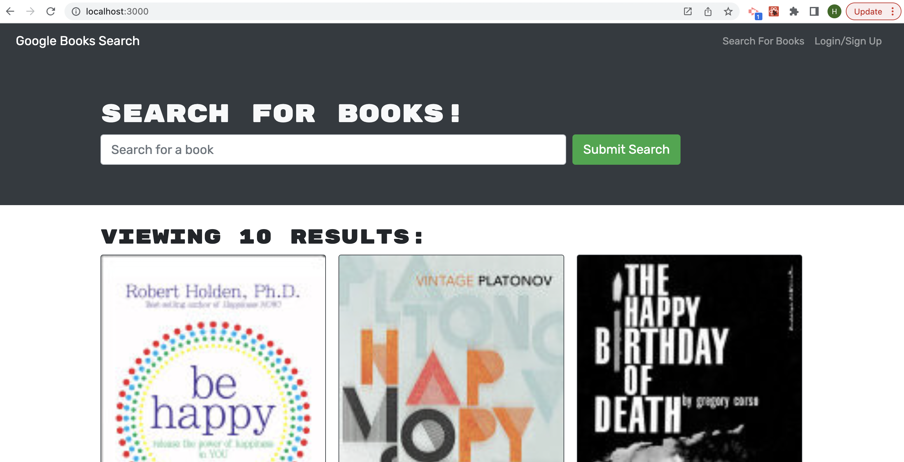

# Book Search Engine Starter Code
A website where a user can search for books and to save favourite books

## Links to the webpage and repository

To access the website use [Bookipedia](https://fathomless-plateau-76545.herokuapp.com/)

To access the GitHub repository use [GitHub Repository bookipedia](https://github.com/Haruka08/bookipedia)

## Content

The website consists of following 3 main sections:

1. Sign Up / Login
    - When you click sign in/login, the users are given the choice to either login or sign up to create a new account
    - To login, an email address and apassword used to created the account are required
    - To sign up, an username, an email address, and a password is required to create a new account

2. Homepage
    - The users are presented with a seach box where they can type in a keyword to search for related books
    - The search will result in cards of books with an option to save the book

3. Saved Book Page
    - The saved book page is user specific and displays the books saved by the user that is logged in

## Screenshot of the website

